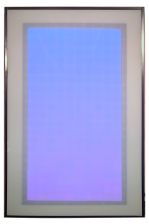
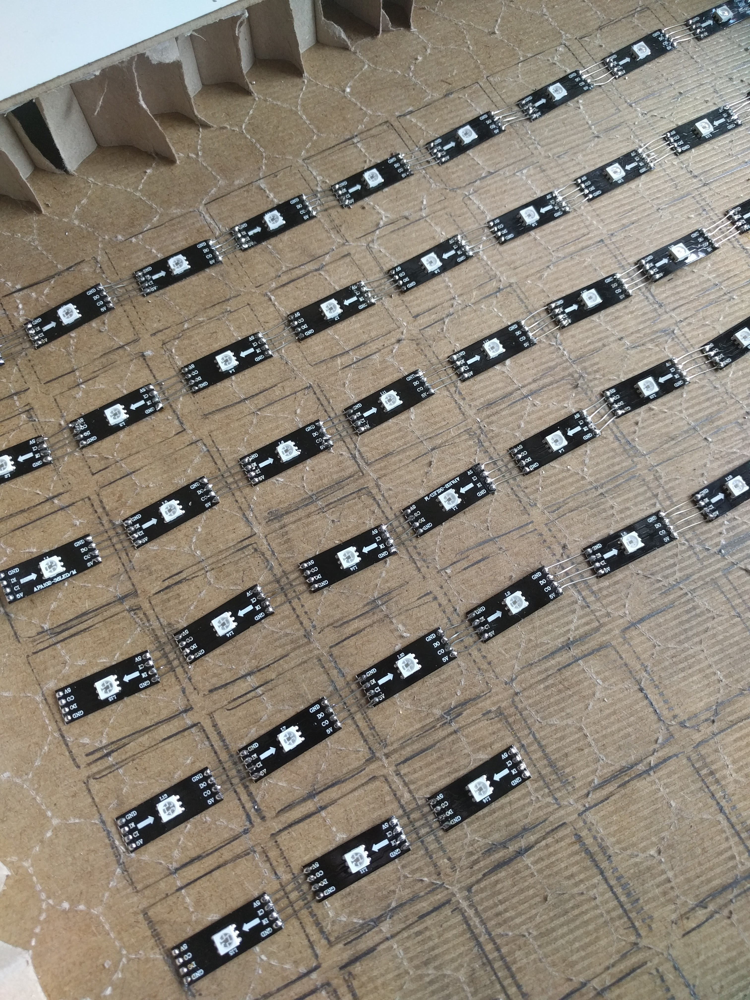

## LED Matrix
Dieses Projekt entstand während eines Praktikums an der [Hochschule Bochum](http://www.hochschule-bochum.de/).  
Aufgabe war es einen LED Tisch zu programmieren auf dem man das Retrospiel Tetris spielen kann. Genutzt worden sind 200 RGBs mit dem Chip APA102.

## Installation
Für die ersten Schritte install.sh ausführen. Danach via `bluetoothctl` sich mit dem Handy pairen. Nach dem pair die `/etc/bluetooth/rfcomm.conf` anpassen.
Programm ein mal ausführen und danach die `settings.json` anpassen.

## Development Umgebung
Für eine angenehmere Programmierumgebung wurde das Plugin [Embedded Linux JVM genutzt](https://plugins.jetbrains.com/plugin/7738-embedded-linux-jvm-debugger-raspberry-pi-beaglebone-black-intel-galileo-ii-and-several-other-iot-devices-).

     
    

